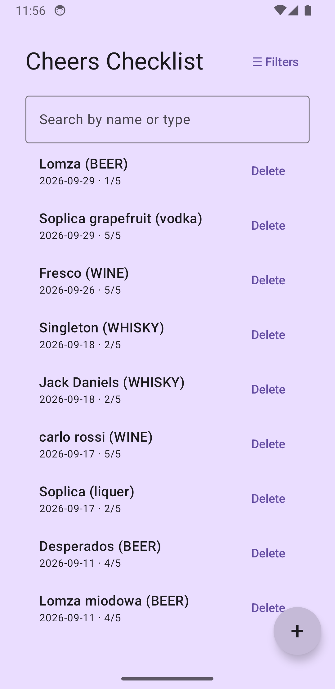
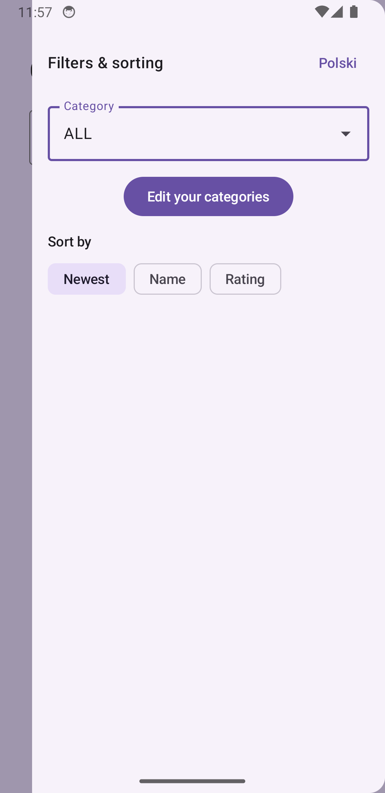
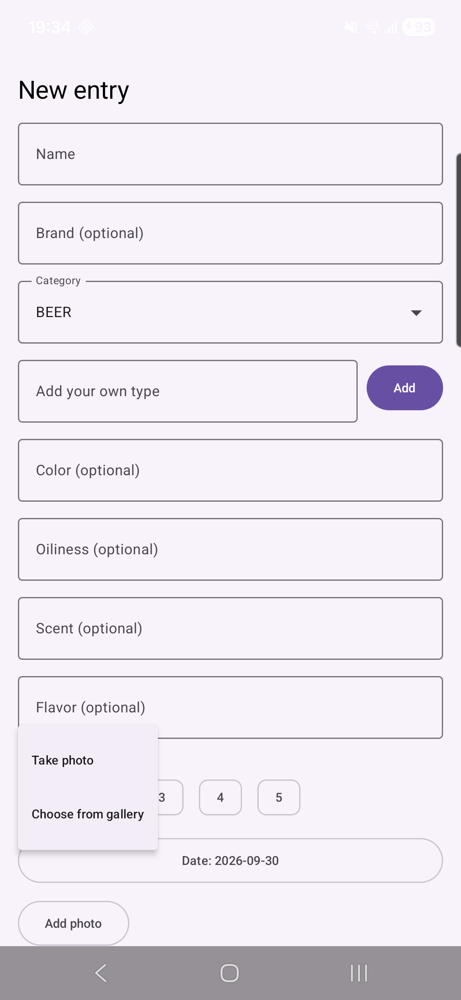
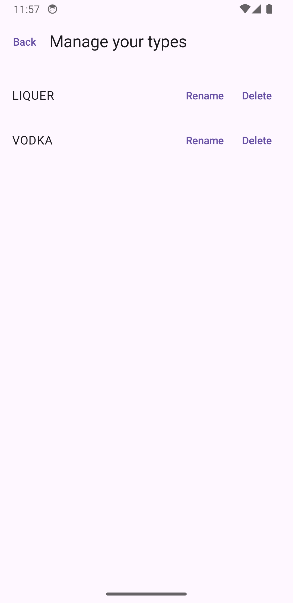

# Cheers Checklist

A personal tasting log for alcoholic drinks, built as a Kotlin Multiplatform (KMP) learning project. It tracks what you've tried, when, and how it tasted — no backend, no account, everything stored locally on-device with Room.

| List screen | Filters drawer |
|---|---|
|  |  |

| Edit/Add screen (photo chooser) | Manage your types |
|---|---|
|  |  |

## Features

- Add, edit, and delete tasting entries
- Fields: name, brand, type (category), color, oiliness, scent, flavor, rating (1–5), date tasted, notes, optional photo
- **Optional photo per entry**, attached from the camera or the gallery (your choice, via a small chooser menu) — shown as a thumbnail with a Remove option; captured photos are auto-corrected for orientation (EXIF-rotated camera shots no longer show sideways)
- Simple validation on required fields (name, rating) — inline "can't be empty" errors instead of a disabled button
- Confirmation dialogs before anything destructive (deleting an entry, deleting a type, discarding an unsaved edit), with the destructive action styled in red
- **User-defined types**: the built-in categories (Whisky, Wine, Beer, Cocktail) are just defaults — add your own from the edit screen, then rename or delete them later from the dedicated "Manage your types" screen (deleting one reassigns its entries to Beer); the full category list is always sorted alphabetically
- Category selection is a dropdown, both when filtering and when editing an entry
- Search by name or type
- Filter by category and sort by newest, name, or rating from a pull-out filters drawer
- **English/Polish UI toggle**, switchable at the top of the filters drawer (resets to English on app restart — not persisted)
- All data persists locally via Room (SQLite) — nothing leaves the device; photos are stored as JPEG files in app-private storage

## Platforms

| Platform | Status |
|---|---|
| Android | Fully built and tested |
| Desktop (JVM) | Fully built and tested |
| iOS | Compiles (`:shared:compileKotlinIosArm64`), not run — no Mac available for this project |

## Tech stack

- **Kotlin Multiplatform** + **Compose Multiplatform** — shared UI across Android/Desktop/iOS
- **Room** (with the `androidx.sqlite` bundled SQLite driver) — local persistence, with tested schema migrations
- **Koin** — dependency injection
- **Navigation Compose** (JetBrains multiplatform port) — list ↔ edit ↔ manage-types screen navigation
- **Koin + kotlinx-coroutines + kotlinx-datetime** — the rest of the shared logic layer
- Camera/gallery photo picking and thumbnail rendering use only first-party platform APIs, no extra image libraries: `ActivityResultContracts` (Android), `UIImagePickerController` via UIKit interop (iOS), `java.awt.FileDialog` (Desktop), and Skia (`org.jetbrains.skia.Image`) for decoding on Desktop/iOS

## Project structure

- [`/shared`](./shared/src) — all shared code (KMP)
  - [`commonMain`](./shared/src/commonMain/kotlin) — UI (Compose), ViewModel, repositories, Room entities/DAOs/migrations, DI module — the vast majority of the app
  - [`androidMain`](./shared/src/androidMain/kotlin) / [`iosMain`](./shared/src/iosMain/kotlin) / [`jvmMain`](./shared/src/jvmMain/kotlin) — platform-specific pieces only: the Room database driver setup per platform, plus the camera/gallery photo picker and thumbnail decoding (`Photo.*.kt`)
  - `commonTest` / `jvmTest` — unit tests, DAO tests, and migration tests (49 tests total)
- [`/androidApp`](./androidApp/src/main) — Android application shell (`MainActivity`, manifest, launcher icon, `FileProvider` config for camera capture)
- [`/desktopApp`](./desktopApp/src/main) — Desktop application shell (`main()`)
- [`/iosApp`](./iosApp/iosApp) — iOS application shell (SwiftUI entry point)

## Architecture

A pragmatic layered approach, not a full Clean Architecture setup:

- **UI** (`ListScreen.kt`, `EditScreen.kt`, `ManageCategoriesScreen.kt`) → **`TastingViewModel`** → **Repositories** (`TastedDrinkRepository`, `CategoryRepository`) → **Room DAOs**
- Repositories are interfaces with a Room-backed implementation, injected via Koin — swappable for tests (see `FakeTastedDrinkRepository` / `FakeCategoryRepository` in the test suite)
- Filtering and sorting happen in-memory in the ViewModel as small, independently unit-tested pure functions (`EntryFilter.kt`, `EntrySort.kt`), rather than as Room queries — the dataset is small, and this keeps that logic trivially testable
- UI text is centralized in `Strings.kt` (plain Kotlin objects per language, not Compose resources) and swapped at runtime via a `StateFlow<AppLanguage>` in the ViewModel
- Photo capture/selection follows the same `expect`/`actual` pattern as `Platform.kt`/`Database.kt` (`Photo.kt` in `commonMain`, one `actual` per platform) — only the resulting file path is stored in the database; the picked/captured image is always copied into app-private storage first, never a raw content URI
- Schema changes go through real Room `Migration`s, each verified with `androidx.room.testing.MigrationTestHelper` against a real (in-memory) database

## Getting started

### Running the apps

- Android: `./gradlew :androidApp:assembleDebug` (or install to a connected device/emulator with `:androidApp:installDebug`)
- Desktop: `./gradlew :desktopApp:run`
- iOS: open [`/iosApp`](./iosApp) in Xcode — requires macOS

### Running tests

- All shared-module tests (unit, DAO, migrations): `./gradlew :shared:jvmTest`

### CI

`.github/workflows/ci.yml` runs the test suite plus Android and Desktop builds on every push/PR to `main`.

## Known limitations

- iOS is compile-checked only, never run — no Mac available, so the camera/gallery picker on iOS is unverified beyond compiling
- No cloud sync / backup — data lives only on the device (this now includes photo files, not just the database)
- Photos aren't shown on the list screen yet, only in the edit screen
- No dark theme yet
